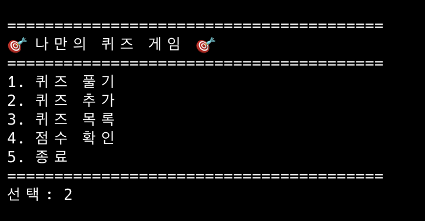
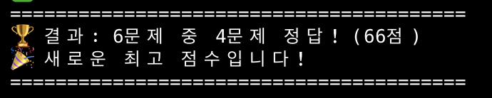
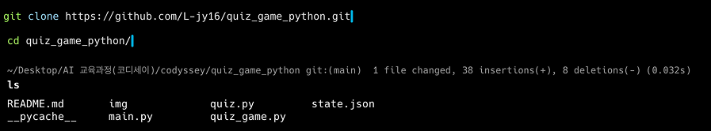
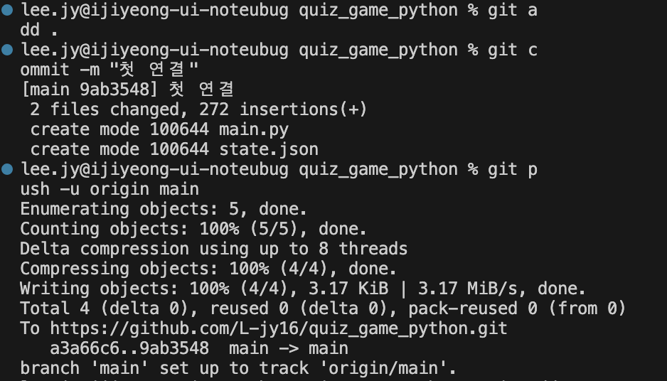
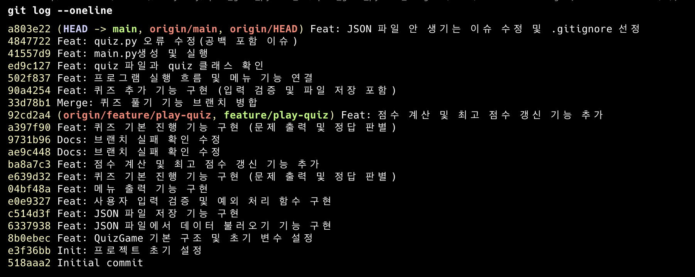
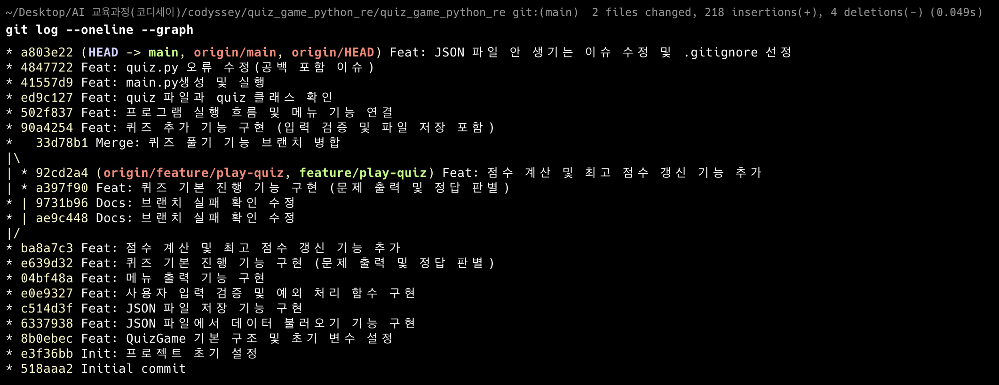
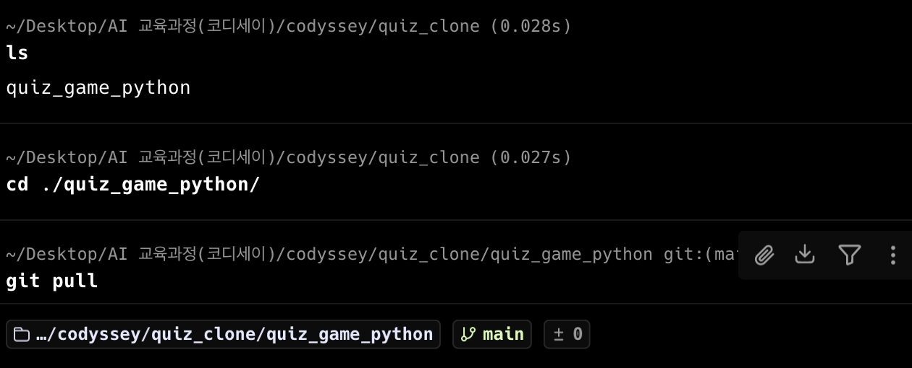
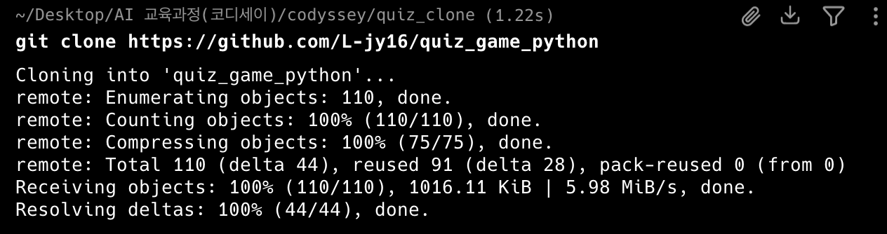

<!-- @format -->

# 콘솔에서 실행되는 퀴즈 게임 만들기

1. 개요
   Python을 이용하여 콘솔 환경에서 실행되는 퀴즈 게임을 구현하였습니다. 퀴즈를 풀고, 문제를 추가할 수 있으며 점수를 확인할 수 있습니다. 프로그램을 종료해도 JSON 파일에 문제들을 저장하여 영구적으로 사용할 수 있습니다.

2. 실행 환경

- OS: macOS
- Python: 3.13.2
- 개발 도구: Visual Studio Code, Terminal

3. 수행 리스트

- [✔] 프로그램 실행됨 (`python main.py`)</br>
- [✔] 메뉴 정상 출력</br>
- [✔] 퀴즈 풀기 가능</br>
- [✔] 퀴즈 추가 가능</br>
- [✔] 점수 저장됨</br>
- [✔] 종료</br>
- [✔] state.json 생성됨</br>
- [✔] 스크린샷 4개 있음</br>
- [✔] GitHub 업로드 완료</br>

4. 디렉토리 구조</br>

   quiz_game_python/</br>
   └── img/</br>
   └── main.py/</br>
   └── quiz.py/</br>
   └── quiz_game.py/</br>
   └── state.json</br></br>

   기능별로 파일을 분리하여 구조를 구성했습니다.
   main.py는 프로그램 실행을 담당하고, quiz.py는 개별 문제를 관리하며, quiz_game.py는 전체 게임의 흐름을 제어합니다. 또한 state.json은 퀴즈 데이터와 점수를 저장하는 역할을 하고, img 폴더는 실행 결과 이미지를 저장하는 데 사용하였습니다. 역할 별로 파일을 구분하여 가독성을 높이고 수정이나 확장을 쉽게 할 수 있습니다.

5. 코드 구조 및 설계

   본 프로젝트는 다음과 같이 구조를 설계하였습니다.

   - Quiz 클래스 → 개별 문제 관리
   - QuizGame 클래스 → 전체 게임 흐름 관리

   기능별로 메서드를 분리하여 유지보수성과 가독성을 높였습니다.

   또한 JSON 파일을 사용하여 데이터 영속성을 구현하였으며,
   try/except를 통해 예외 상황에서도 안전하게 종료되도록 설계하였습니다.

   JSON 파일 데이터 영속성 관련 설명 - 프로그램을 시작할 때는 load_state()을 이용하여 state.json 파일을 읽어옵니다. quizzes는 객체 형태로 데이터를 복원하고 best_score의 데이터도 같이 불러옵니다. 만약 json 파일이 없거나 손상이 된 경우에는 기본 퀴즈와 초기 점수로 덮어씌어 저장합니다. 프로그램이 종료할 때 save_state()를 이용하여 퀴즈 목록을 딕셔너리 형태로 변환하고 최고 점수와 함께 state.json에 저장합니다. 이런 과정을 통해 프로그램을 종료하고 다시 시작 했을 때 그전의 데이터가 유지되어 이전 상태를 가져와서 사용할 수 있습니다.

6. 핵심 기술 적용

   1. 클래스

      코드의 역할을 분리하여 유지보수성과 가독성을 높이기 위해 사용했습니다.

   2. JSON

      데이터를 파일로 저장하여 프로그램 종료 후에도 유지하기 위해 사용했습니다.

   3. try/except

      파일 오류 및 입력 오류 발생 시 프로그램이 종료되지 않도록 하기 위해 사용했습니다.

   4. 브랜치

      기능별 개발을 분리하여 협업과 관리 효율성을 높이기 위함입니다.

   5. 데이터 구조 설계

      퀴즈 데이터를 리스트와 딕셔너리 형태로 관리했습니다.

7. 실행 방법

```python
python3 main.py
```

6. 수행 결과

   1. 메뉴 화면

      

   2. 퀴퀴즈 진행

      

   3. 퀴즈 추가

      

      

   4. 점수 확인

      

      

      

   5. 문제 목록 출력

      

   6. 종료

      

   7. state.json 생성됨

      

      

   8. GitHub 업로드 완료

      

      

7. 입력 오류 처리
   프로그램은 다음과 같은 입력 오류를 처리하도록 구현하였습니다.

   - 공백 입력 → 재입력 요청
   - 문자 입력 → 숫자로 입력하라는 안내 메시지 출력
   - 범위 밖 숫자 → 올바른 범위 안내 후 재입력
   - Ctrl + C → 프로그램 안전 종료

   👉 관련 코드: `get_int_input()` 함수

   ```python
   if user_input == "":
       print("빈 입력은 허용되지 않습니다.")
   ```

   ```python
   except ValueError:
       print("숫자로 입력해야 합니다.")
   ```

8. 기본 퀴즈 5개 이상 포함

   기본 퀴즈는 총 6개 이상 포함되어 있으며,
   프로그램 실행 시 자동으로 로드됩니다.

   👉 관련 코드: `get_default_quizzes()`

   또한 아래 화면에서 확인할 수 있습니다.

   

   ***

9. json 데이터 구조 설계 이유

   `state.json`은 다음과 같은 구조로 설계했습니다.

   ```json
   {
     "quizzes": [
       {
         "question": "...",
         "choices": ["...", "...", "...", "..."],
         "answer": 2
       }
     ],
     "best_score": 3
   }
   ```

   퀴즈는 여러 개를 순서대로 관리하고 확장하기 위해 리스트로 구성했으며, 각 퀴즈는 질문·보기·정답과 같이 서로 다른 데이터를 명확히 표현하기 위해 딕셔너리로 설계했고, 보기는 순서가 중요한 리스트, 정답은 비교를 단순화하기 위해 숫자로 저장했으며, 최고 점수는 문제 데이터와 역할이 달라 별도의 최상위 필드로 분리해 관리했습니다.

10. Git 커밋 내역

총 10개 이상의 의미 있는 커밋을 수행하였습니다.

```bash
git log --oneline
```



git log --oneline은 커밋 기록을 간단하게 한줄씩 확인할 수 있는 명령어 입니다.</br></br>

커밋 단위와 메시지 규칙은 작업 단위를 작게 나누어 기능별로 기록하였으며 메시지는 어떤 동작을 하였는지 알 수 있도록 작업 단위 마다 작성 하였습니다. 이렇게 나눈 이유는 나중에 커밋 기록을 볼 때 어떤 기능이 언제 추가되었는지 추적하기 쉽고, 문제 발생 시 어느 변경에서 생긴 문제인지 확인하기 편하기 때문입니다.

10. 브랜치 및 병합
    브랜치를 생성하여 기능 개발 후 main 브랜치에 병합하였습니다.

    ```bash
    git checkout -b feature/quiz-play
    git merge feature/quiz-play
    ```

    

    git checkout -b feature/quiz-play은 feature/quiz-play이라는 브랜치를 -b로 생성하고 checkout을 통해 브랜치로 이동하는 명령어입니다.</br> </br>

    git merge feature/quiz-play은 merge를 통해 현재 브랜치에 eature/quiz-play 브랜치 내용을 병합하는 명령어입니다.
    </br> </br>

    가지처럼 보이지 않는 이유는 다른 출발점에서 따로 커밋을 해야하는데 같은 출발 위치에서 출발했기 때문입니다.

    

    git의 가지를 보여주기 위한 이미지입니다.

11. clone / pull 실습
    프로젝트 완료 후 다음 과정을 수행하였습니다.

    1. 저장소 clone
    2. 파일 수정 후 push
    3. 기존 디렉토리에서 pull 수행

    ```bash
       git clone https://github.com/L-jy16/quiz_game_python
       git pull
    ```

    

    

12. 트러블 슈팅

    1. Python 실행 오류

       터미널에서 python main.py를 실행했을 때 "command not found" 오류가 발생했습니다. 원인을 몰라 검색과 ai를 이용해서 알아본 결과 macOS에서는 기본적으로 python 명령어가 없고 python3로 실행해야 했습니다.해결 방안으로는 python3 main.py 명령어를 이용하여 실행해야합니다.

    2. 사용자 입력 오류

       사용자가 숫자를 입력하였는데 오류가 발생했습니다. 원인을 찾기가 힘들었습니다. 오류가 나고 다시 종료해서 다시켜 숫자를 입력했을 경우에는 성공하였습니다. 우연치 않게 다시 입력했을 때 실수로 공백을 넣고 입력했더니 같은 오류가 발생하여 원인을 찾게 되었습니다. 해결 방안으로는 공백과 문자 입력을 처리하고 범위를 검사하는 코드를 추가하여 보안했습니다.

    ```python
       def get_int_input(self, prompt, min_value, max_value):
      # 올바른 값을 입력할 때까지 계속 반복
      while True:
          try:
              # 사용자 입력을 받고, 앞뒤 공백을 제거함
              # strip = 공백 제거
              user_input = input(prompt).strip()

              # 아무것도 입력하지 않고 엔터만 누른 경우 처리
              if user_input == "":
                  print("빈 입력은 허용되지 않습니다. 다시 입력하세요.")
                  # 다시 입력받기 위해 반복문의 처음으로 돌아감
                  continue

              # 입력값을 문자열에서 정수로 변환
              number = int(user_input)

              # 입력한 숫자가 허용 범위를 벗어난 경우 처리
              if number < min_value or number > max_value:
                  print(f"{min_value}부터 {max_value} 사이의 숫자를 입력하세요.")
                  # 다시 입력받기 위해 반복문의 처음으로 돌아감
                  continue

              # 위의 모든 조건을 통과하면 올바른 숫자이므로 반환
              return number

          # 문자를 입력해서 숫자로 변환할 수 없는 경우 처리
          except ValueError:
              print("숫자로 입력해야 합니다. 다시 입력하세요.")

          # 사용자가 Ctrl + C를 눌러 강제로 입력을 중단한 경우 처리
          except KeyboardInterrupt:
              print("\n입력이 중단되었습니다. 프로그램을 안전하게 종료합니다.")
              # 종료 전에 현재 데이터를 저장
              self.save_state()
              # 프로그램 종료
              raise SystemExit

          # 입력 스트림이 종료된 경우 처리
          # 예: Ctrl + D 같은 입력 종료 상황
          except EOFError:
              print("\n입력 스트림이 종료되었습니다. 프로그램을 안전하게 종료합니다.")
              # 종료 전에 현재 데이터를 저장
              self.save_state()

              # 프로그램 종료
              raise SystemExit
    ```

    3. git 가지가 안 보이는 이슈

       브랜치를 생성했지만 실제로는 main와 브랜치가 하나의 가지로 보여지는 현상이 있습니다. 원인으로는 서로 다른 방향으로 커밋되고 하나의 흐름으로 이어져서 하나의 가지로 이어졌던 거였습니다. 해결 방안으로는
       같은 기준 커밋에서 각 브랜치에서 서로 다른 커밋을 수행하였고, 그 결과 그래프에서 가지 형태로 분기되는 것을 확인할 수 있었습니다.

13. 생각하기

    1. JSON의 한계

       JSON은 데이터를 저장하기에 간단하고 사용하기 쉽지만, 데이터가 많아지면 파일이 길어지고 관리하기 어려워질 수 있습니다. 또한 데이터가 서로 복잡하게 연결된 경우에는 JSON만으로 처리하기 어렵습니다.

    2. 데이터 손상 대응

       프로그램 실행 중 JSON 파일이 없거나, 파일 내용이 깨진 경우 오류가 발생 했을 때 이 문제를 해결하기 위해 try/except를 사용하여 오류가 발생해도 프로그램이 멈추지 않도록 처리합니다. 퀴즈 게임으로 예를 들면 기존의 JSON 파일이 손상되거나 없는 경우에 기본 데이터르 불러와 수행하도록 처리 하였습니다.

    3. 요구사항 변경 시 수정 포인트

       프로그램의 기능은 대부분 QuizGame 클래스에 모여 있기 때문에, 새로운 기능이 추가되거나 수정이 필요할 경우 해당 클래스의 메서드를 중심으로 수정하면 됩니다. 예를 들어 퀴즈 삭제 기능이나 랜덤 출제 기능을 추가할 때도 QuizGame을 수정하면 쉽게 확장할 수 있습니다.

    4. 클래스와 함수

       함수는 기능을 수행하는 코드 단위로 입력을 받아 결과를 반환하므로 하나의 작업을 처리할 때나 반복되는 작업을 줄이고 싶을 때 사용합니다. 클래스는 데이터와 기능을 함께 묶어서 관리하는 구조로 프로그램의 상태를 유지하고 체계적으로 코드를 구성하거나 여러 개의 데이터와 기능을 함께 관리할 때 사용합니다. 만일 상태를 지속적으로 관리해야하거나, 여러 개의 객체를 생성해서 사용하는 경우에는 함수보다는 클래스를 사용하는게 가독성과 유지보수성을 향상시키고 더 효율적입니다.
